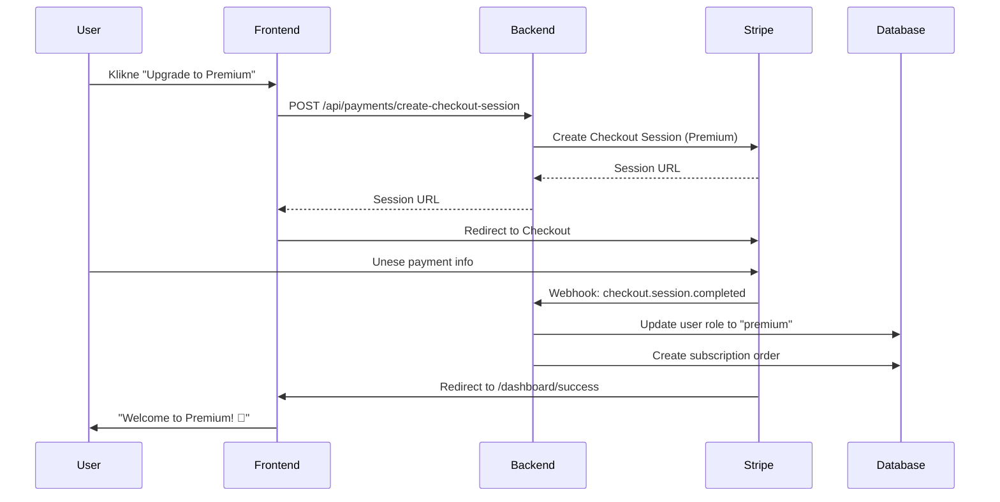
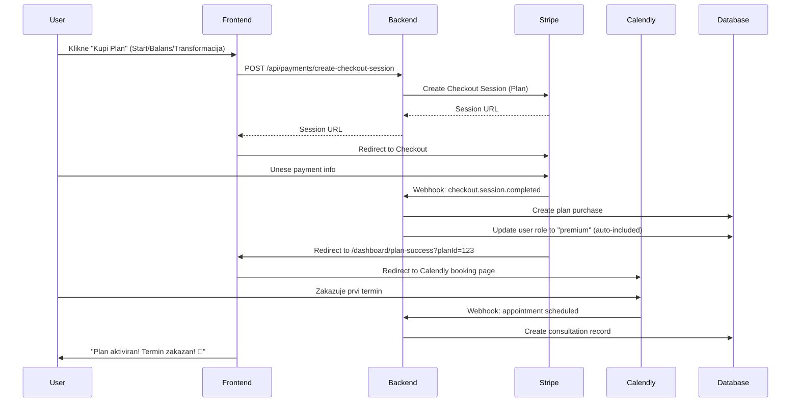

# 💳 Stripe Integration Setup

## 📋 Pregled

Nutri Klub koristi **Stripe** za procesiranje plaćanja za:
1. **Premium Membership** (35€/godišnje ili 4€/mesečno)
2. **Planove Ishrane** (Start 90 KM, Balans 190 KM, Transformacija 390 KM)

---

## 🔧 Setup (Test Mode)

### 1. Kreirati Stripe Account

1. Idi na https://stripe.com
2. Registruj se (besplatno)
3. Aktiviraj **Test Mode** (toggle u gornjem desnom uglu)

### 2. Dobiti API Ključeve

1. Idi na **Developers → API keys**
2. Kopiraj:
   - **Publishable key** (počinje sa `pk_test_...`)
   - **Secret key** (počinje sa `sk_test_...`)

### 3. Dodati u `.env` fajl

```env
# Stripe Keys (Test Mode)
STRIPE_SECRET_KEY=sk_test_...
STRIPE_PUBLISHABLE_KEY=pk_test_...
STRIPE_WEBHOOK_SECRET=whsec_...  # Dobićeš kasnije

# Stripe Webhook URL (za local dev)
STRIPE_WEBHOOK_URL=http://localhost:5000/api/payments/webhook
```

### 4. Instalirati Stripe pakete

```bash
npm install stripe @stripe/stripe-js
```

---

## 📦 Proizvodi i Cene

### Premium Membership

| Plan | Cena | Stripe Price ID | Opis |
|------|------|----------------|------|
| **Mesečno** | 4€/mesec | `price_xxx` | Mesečna pretplata |
| **Godišnje** | 35€/godišnje | `price_xxx` | Godišnja pretplata (ušteda 13€) |

**Uključuje:**
- Neograničeni recepti
- 15+ premium e-bookova
- Neograničen AI chat
- 7-dnevni meal planner
- Progress tracking
- Community pristup

### Planovi Ishrane

| Plan | Cena | Stripe Price ID | Konsultacije | Trajanje |
|------|------|----------------|--------------|----------|
| **Start** | 90 KM (~46€) | `price_xxx` | 1x | 1 mesec |
| **Balans** | 190 KM (~97€) | `price_xxx` | 3x | 3 meseca |
| **Transformacija** | 390 KM (~199€) | `price_xxx` | 6x | 6 meseci |

**Uključuje:**
- SVE iz Premium tier-a
- Personalizovani plan ishrane
- 1-on-1 konsultacije
- Direktan kontakt sa nutricionistom
- Weekly/Bi-weekly check-ins

---

## 🔄 Payment Flow

### Premium Membership Flow



### Plan Purchase Flow



---

## 🎣 Webhooks Setup

### 1. Lokalni Development (Stripe CLI)

```bash
# Instaliraj Stripe CLI
brew install stripe/stripe-brew/stripe

# Login
stripe login

# Forward webhooks to local server
stripe listen --forward-to localhost:5000/api/payments/webhook

# Kopiraj webhook signing secret (whsec_...) u .env
```

### 2. Production Webhooks

1. Idi na **Developers → Webhooks**
2. Klikni **Add endpoint**
3. URL: `https://your-domain.com/api/payments/webhook`
4. Selektuj events:
   - `checkout.session.completed`
   - `customer.subscription.created`
   - `customer.subscription.updated`
   - `customer.subscription.deleted`
   - `invoice.payment_succeeded`
   - `invoice.payment_failed`

---

## 🧪 Testiranje

### Test Credit Cards (Stripe Test Mode)

| Scenario | Card Number | Expiry | CVC | Zip |
|----------|-------------|--------|-----|-----|
| **Uspešna uplata** | `4242 4242 4242 4242` | Any future date | Any 3 digits | Any |
| **Neuspešna uplata** | `4000 0000 0000 0002` | Any future date | Any 3 digits | Any |
| **3D Secure** | `4000 0027 6000 3184` | Any future date | Any 3 digits | Any |

### Test Flow

1. **Premium Membership Test:**
   ```bash
   # Login kao free user
   Email: test@example.com
   Password: password123

   # Klikni "Upgrade to Premium"
   # Unesi test karticu: 4242 4242 4242 4242
   # Proveri da li je user role promenjen u "premium"
   ```

2. **Plan Purchase Test:**
   ```bash
   # Login kao free user
   Email: test@example.com
   Password: password123

   # Klikni "Kupi Start Plan"
   # Unesi test karticu: 4242 4242 4242 4242
   # Proveri redirect na Calendly
   # Proveri da li je user role promenjen u "premium"
   # Proveri da li je plan purchase kreiran u database
   ```

---

## 📊 Database Schema

### `subscription_orders` table

```typescript
{
  id: number;
  userId: number;
  orderType: 'premium_monthly' | 'premium_yearly' | 'plan_start' | 'plan_balans' | 'plan_transformacija';
  amount: string;
  currency: 'EUR' | 'BAM';
  status: 'pending' | 'completed' | 'failed' | 'cancelled' | 'refunded';
  stripeSessionId: string;
  stripePaymentIntentId: string;
  stripeCustomerId: string;
  metadata: object;
  createdAt: string;
  completedAt: string;
}
```

### `plan_purchases` table

```typescript
{
  id: number;
  orderId: number;
  userId: number;
  planType: 'start' | 'balans' | 'transformacija';
  consultationsTotal: number; // 1, 3, 6
  consultationsUsed: number;
  startDate: string;
  endDate: string;
  status: 'active' | 'completed' | 'cancelled';
  calendlyUrl: string;
  createdAt: string;
}
```

### `consultations` table

```typescript
{
  id: number;
  planPurchaseId: number;
  userId: number;
  scheduledDate: string;
  duration: number; // minutes
  status: 'scheduled' | 'completed' | 'cancelled' | 'rescheduled';
  calendlyEventUri: string;
  notes: string;
  createdAt: string;
  completedAt: string;
}
```

---

## 🔐 Security Best Practices

1. **Nikada ne šalji Secret Key na frontend!**
   - `STRIPE_SECRET_KEY` samo na backend
   - `STRIPE_PUBLISHABLE_KEY` može na frontend

2. **Verifikuj webhooks:**
   ```typescript
   const signature = req.headers['stripe-signature'];
   const event = stripe.webhooks.constructEvent(
     req.body,
     signature,
     process.env.STRIPE_WEBHOOK_SECRET
   );
   ```

3. **Idempotency:**
   - Proveri da li order već postoji pre kreiranja novog
   - Koristi `stripeSessionId` kao unique identifier

4. **Error Handling:**
   - Loguj sve Stripe errors
   - Pošalji email notifikaciju za failed payments
   - Retry logic za webhook failures

---

## 📞 Support

- **Stripe Docs:** https://stripe.com/docs
- **Stripe Dashboard:** https://dashboard.stripe.com
- **Stripe Support:** support@stripe.com

---

## 🚀 Go Live Checklist

Kada budeš spreman za production:

- [ ] Prebaci Stripe account iz Test Mode u Live Mode
- [ ] Zameni test API keys sa live keys u `.env`
- [ ] Setup production webhooks
- [ ] Testiraj sa pravom karticom (mala suma)
- [ ] Aktiviraj Stripe Radar (fraud prevention)
- [ ] Setup email notifikacije za payments
- [ ] Dodaj Terms of Service i Refund Policy
- [ ] Compliance check (GDPR, PCI DSS)

---

**Status:** 🔄 Test Mode Active
